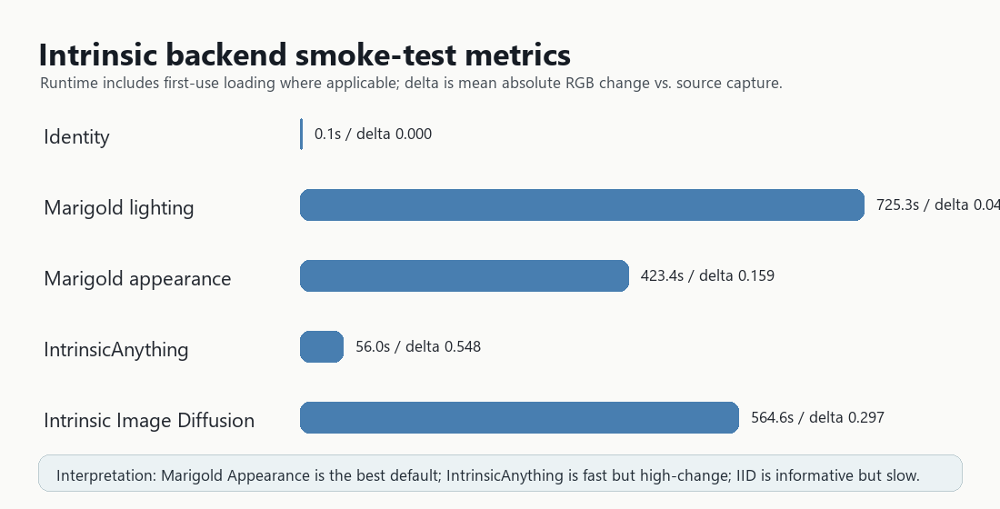

# Restoring PBR Material Layers from Photoreal Capture Primitives

**A screen-space intrinsic decomposition and UV-voting pipeline for Gaussian splats, scans, and extracted meshes**

**Date:** 2026-06-17  
**Author:** Gregor Koch  
**Prototype:** `F:\pbr-from-pixelart\pbr_surface.py` and `C:\Users\gregor\Documents\CubeBauhausOnline\tools\intrinsic_ab_test.py`  
**Interactive demo:** <http://127.0.0.1:7862>

## Abstract

Gaussian splatting and photogrammetry can reproduce a scene with high photographic fidelity, but the captured appearance is usually baked radiance rather than a renderer-native material model. When such assets are placed in Unreal Engine, Blender, WebGPU, or another physically based renderer, relighting often fails because albedo, roughness, metallicity, normals, height, and semantic material categories are absent or unreliable. We present a small end-to-end prototype that converts paired screen captures into UV-space PBR material atlases. The key constraint is to preserve the relationship between screen-space observations and texture coordinates: every intrinsic-image prediction and every material tag is projected back through a UV/object-coordinate pass. After an initial towel smoke test, we reran the pipeline on multi-material Google Scanned Objects assets. The single-view examples exposed the real problem rather than solving it: material labels from one view are sparse and often wrong. The corrected path uses split-source processing plus overlapping multiview capture: use intrinsic decomposition for de-lit texture values, tag materials from original RGB views, vote all labels into UV space, then complete the sparse atlas with a UV-occupancy-constrained resistance fill.


## 1. Motivation

Photoreal capture primitives are strong at reproducing the lighting conditions under which they were observed. That strength becomes a weakness when an application needs new lights, edited materials, dynamic time of day, gameplay illumination, or physically plausible asset reuse. Gaussian splats encode radiance-like appearance in point/ellipsoid attributes; scanned meshes often carry a single baked diffuse texture; extracted surfaces from splats or dense captures may inherit colors that include shadows, highlights, and camera exposure. These representations can look realistic in a fixed view and fail as soon as a renderer asks, "what is the base color of this surface under neutral lighting?"

The practical question is:

> Can we take a Gaussian splat, extracted mesh, or scanned textured mesh, screenshot it in world space while preserving texture/UV correspondence, and recover a usable PBR material layer stack?

Our answer is yes for a constrained prototype: render paired color and UV/object-coordinate images, run intrinsic decomposition on the color pass, segment and tag visible material regions with a VLM, then vote the results back into UV texture space.

## 2. Related Work

3D Gaussian Splatting represents scenes with optimized anisotropic 3D Gaussians and provides real-time novel-view rendering quality, but it is not a PBR material representation by itself [1]. Physically based renderers commonly expect material parameters such as base color, normal, roughness, metallicity, occlusion, and height/displacement, following practical BRDF workflows such as the Disney principled model [2].

Intrinsic image decomposition tries to separate material reflectance from illumination. Marigold extends diffusion-based image analysis to intrinsic decomposition and provides separate IID checkpoints for appearance and lighting outputs [3, 4]. IntrinsicAnything and Intrinsic Image Diffusion are stronger research candidates for inverse rendering and material estimation; both provide diffusion priors for albedo/material prediction [5, 6]. Segment Anything provides a promptable segmentation foundation model that can be used as an optional region proposal source [7]. Our validation objects come from Google Scanned Objects, an open collection of scanned household assets [8].

This prototype is not a replacement for calibrated inverse rendering. It is a pragmatic bridge from capture-native appearance to renderer-native material maps.

## 3. Method

The pipeline keeps every screen-space prediction grounded by an explicit UV pass.

| Stage | Input | Output | Purpose |
|---|---|---|---|
| Render/capture | Mesh, splat-derived mesh, or scanned asset | `*_color.png`, `*_uv.png` | Capture visible appearance and texture-coordinate relation. |
| Intrinsic/de-lighting | Color capture | Albedo candidate, optional shading/roughness/metal/specular | Remove lighting from material decisions. |
| Region segmentation | Source color capture, or albedo for ablations | Connected regions or external masks | Split material-relevant surface regions. |
| VLM material tagging | RGB region crops | Material labels and texture cues | Convert visual regions into semantic PBR priors before color cues are washed out. |
| UV vote | De-lit albedo, RGB labels, UV pass | UV-space albedo atlas and material map | Preserve renderer-native texture coordinates. |
| PBR synthesis | Albedo + material labels | Normal, height, ORM | Generate a renderer-consumable material set. |

### 3.1 Paired capture

For each camera view, we render two aligned images:

1. A conventional RGB color capture.
2. A UV/object-coordinate capture that encodes where each screen pixel lands in texture space.

The second image is what makes the system useful. It allows a model that only understands ordinary images to operate in screen space while the system still writes results to atlas space.


### 3.2 Intrinsic/de-lighting backends

We tested five backends:

| Backend | Produced channels | Runtime in smoke test | Delta vs. source RGB | Notes |
|---|---:|---:|---:|---|
| Identity baseline | Albedo copy, grayscale shading | 0.1 s | 0.000 | No de-lighting; useful control. |
| Marigold Lighting | Albedo, shading, residual | 725.3 s | 0.043 | Strong lighting separation, but washed out woven detail. |
| Marigold Appearance | Albedo, roughness, metallicity | 423.4 s | 0.159 | Best default in this test; preserved textile regions. |
| IntrinsicAnything | Albedo, specular | 56.0 s | 0.548 | Fast after setup; lifts background and compresses contrast. |
| Intrinsic Image Diffusion | Albedo, roughness, metal | 564.6 s | 0.297 | Ran successfully, but albedo had gray/brown relighting bias. |




The delta value is the mean absolute RGB difference between the predicted albedo and the original color capture. It is not a physical accuracy score; it is only a compact smoke-test signal showing how aggressively each backend changes the image.

### 3.3 Region tagging

The current implementation supports connected color-region segmentation, external mask folders, and optional SAM/SAM2 integration paths. Connected regions were enough for the current multi-material smoke tests, though the toaster failure case shows why stronger masks will be needed for broad glossy appliances. Each region crop is sent to a local OpenAI-compatible VLM endpoint. The best run used `qwen/qwen3-vl-30b` through LM Studio.

The initial towel scene was useful for backend selection, but it was not a meaningful material-divergence test. We therefore repeated the end-to-end run on Google Scanned Objects assets with visibly different materials. The single-view versions are retained as diagnostics, not as the final solution.

### 3.4 Split-source material tagging

The first multi-material scissors run exposed a failure mode: when the VLM tagged regions from Marigold's de-lit albedo, the red handles lost their strongest semantic cue and the map collapsed toward a generic plastic field. The corrected pipeline uses the original RGB capture for segmentation and semantic labels, while still using Marigold Appearance for the UV-space albedo values.


The corrected single-view runs used `qwen/qwen3-vl-30b` through LM Studio and connected-region segmentation. Results are segment counts, not physical ground truth. They are useful for debugging prompt and segmentation behavior, but they remain view-biased.

| Asset | Expected material contrast | RGB-derived VLM segment labels | Vision calls | Fallbacks | Direct atlas coverage |
|---|---|---|---:|---:|---:|
| Red scissors | Plastic handles, steel blades | `plastic` 12, `metal_steel` 8 | 21 | 0 | 0.83% |
| Cushion-grip screwdriver | Plastic grip, steel shaft | `plastic` 20, `metal_steel` 12 | 33 | 0 | 0.47% |
| Snap-lock can opener | Black plastic/rubber, steel cutter | `plastic` 7, `metal_steel` 12 | 20 | 0 | 0.91% |


The toaster candidate was also tested. It exposed a useful remaining problem: a large reflective unassigned body region was filled as `stone` by the fallback heuristic even though smaller segmented regions were correctly tagged as `metal_steel`. That is not a reason to discard the pipeline, but it shows that manufactured-object priors and better region proposal masks matter for appliances and broad glossy surfaces.

### 3.5 Overlapping multiview voting

We added a generated `sphere32` Blender capture mode that renders 32 overlapping RGB/UV pairs from a Fibonacci sphere around the asset. The existing baker already accumulates material votes per UV texel across all capture pairs, so the multiview fix is a capture protocol change rather than a new atlas algorithm.

On the can opener, the single-view material atlas was front-view biased: 9,158 tagged atlas pixels voted `plastic` and only 416 voted `metal_steel`. The 32-view pass used 384 region-level VLM calls with zero fallbacks and changed the UV vote to 14,973 `metal_steel`, 6,008 `plastic`, and 287 `unknown` pixels. Direct atlas coverage rose from 0.91% to 2.71% at 512px captures. This still is not full texture coverage, but it is a much better validation of the UV voting mechanism.


| Capture protocol | Capture pairs | VLM region calls | Fallbacks | Direct atlas coverage | Tagged atlas coverage | Main issue |
|---|---:|---:|---:|---:|---:|---|
| Single front view | 1 | 20 | 0 | 0.91% | 0.91% | Front-view material bias. |
| `sphere32` multiview | 32 | 384 | 0 | 2.71% | 2.03% | Costly; still sparse at 512px captures. |

### 3.6 UV-space resistance fill

The multiview vote gives higher-confidence samples, but it is still sparse because many atlas texels are never hit by a screen pixel. A naive dilation can fill those holes, but it also spreads across empty atlas padding and material boundaries. The implemented fix is a resistance-weighted UV flood constrained by a target mask. The target mask represents known UV island territory; for this scanned can opener we derived it from non-empty source texture texels, and for splat-derived meshes the same mask should come from a UV occupancy rasterization of the extracted triangles.

For each missing texel, neighboring samples vote with a weight proportional to `exp(-resistance * color_difference)` in a provisional guide image. This allows fills to continue through smooth texture regions while resisting strong albedo or material-edge changes. Material IDs are expanded with the same guide, so labels spread through compatible UV neighborhoods instead of simple nearest-neighbor padding.

On the can opener, direct 32-view coverage was 2.71% of the atlas and direct tagged coverage was 2.03%. The inferred UV occupancy target covered 39.34% of the atlas. A 96px resistance fill covered 35.89% of the atlas, or 91.23% of the UV target, and expanded tagged material pixels to 34.84%. The filled material map contained 266,033 `metal_steel`, 98,414 `plastic`, and 883 `unknown` pixels.


| UV completion stage | Atlas coverage | Tagged atlas coverage | Notes |
|---|---:|---:|---|
| Direct `sphere32` samples | 2.71% | 2.03% | Trusted but too sparse for renderer export. |
| UV occupancy target | 39.34% | n/a | Estimated island domain from the scan texture. |
| 96px resistance fill | 35.89% | 34.84% | Covers 91.23% of the target without filling empty atlas padding. |

### 3.7 PBR atlas generation

Each corrected and completed material map was combined with a de-lit Marigold albedo atlas and converted into renderer-style maps:

| Map | Role |
|---|---|
| `albedo_baked.png` | De-lit UV-space base color candidate. |
| `source_baked_albedo_materials.png` | Integer material-label atlas from original RGB regions. |
| `pbr/albedo_baked_n.png` | Normal map synthesized with material-aware relief priors. |
| `pbr/albedo_baked_h.png` | Height map for parallax/displacement-style workflows. |
| `pbr/albedo_baked_orm.png` | Occlusion, roughness, metallicity map. |

The false-color previews remap exact material IDs for readability. The underlying material map stores integer IDs such as `12` for `metal_steel` and `25` for `plastic`.

## 4. Demonstration Command

The A/B harness can be used interactively:

```powershell
python C:\Users\gregor\Documents\CubeBauhausOnline\tools\intrinsic_ab_test.py --app --host 127.0.0.1 --port 7862
```

The current best default is to run Marigold Appearance first, then run material segmentation/tagging from the original RGB capture and combine both products in the atlas stage:

```powershell
python C:\Users\gregor\Documents\CubeBauhausOnline\tools\intrinsic_ab_test.py `
  --backends marigold_appearance `
  --size 1024 `
  --device cuda `
  --output C:\Users\gregor\Documents\CubeBauhausOnline\artifacts\intrinsic-ab-test\app-runs
```

For VLM material tagging, the local LM Studio endpoint must expose a vision-capable model:

```text
http://127.0.0.1:1234/v1/chat/completions
model: qwen/qwen3-vl-30b
```

## 5. Discussion

The central result is not that one intrinsic model perfectly recovers true physical material parameters. It does not. The useful result is architectural: a screen-space AI model can be inserted into a renderer pipeline if a UV/object-coordinate pass is captured alongside the color pass. This makes intrinsic predictions, segmentation masks, and VLM material tags writable into ordinary texture atlases.

The prototype is especially relevant for Gaussian splat workflows because splats are compelling as capture primitives but awkward as relightable asset primitives. If a splat can be converted to a mesh, sampled into a mesh, or rendered with an auxiliary coordinate pass, the same method applies. The renderer can keep using normal PBR shaders while the capture model provides appearance evidence.

Marigold Appearance is the best current default because it gives a useful albedo candidate and material-property hints while preserving enough region structure for UV baking. Marigold Lighting is useful when explicit shading separation matters, but in the initial towel test it suppressed woven detail into the lighting channels. IntrinsicAnything and Intrinsic Image Diffusion are worth keeping as optional backends, but neither beat Marigold Appearance on the first local validation object.

## 6. Limitations

This is a prototype smoke test, not a benchmark.

1. The current multi-material validation is still a smoke test, not a full benchmark.
2. Single-view examples are not sufficient for material correctness; overlapping multiview capture is required.
3. Even 32 views at 512px produced only 2.71% direct atlas coverage on the can opener, so a UV-space completion stage is required before renderer export.
4. Roughness, metallicity, height, and normal maps are plausible renderer inputs, not measured ground truth.
5. VLM material labels can be wrong on ambiguous or mixed-material crops.
6. Shadow removal is only as good as the intrinsic backend.
7. Gaussian splat assets still need a reliable way to render or derive coordinate/UV passes.

## 7. Conclusion

The prototype demonstrates an end-to-end path from photoreal capture appearance to renderer-native PBR maps. The important engineering move is to preserve UV correspondence while applying screen-space AI models. With a paired RGB/UV capture, diffusion-based intrinsic decomposition can reduce lighting leakage, VLM tagging can recover semantic material classes, and the resulting predictions can be baked into conventional albedo, normal, height, ORM, and material-label atlases.

For the current local test, the recommended pipeline is:

```text
32x overlapping Color + UV captures -> Marigold Appearance albedo -> RGB-connected region segmentation -> Qwen VLM tags -> UV vote -> UV occupancy resistance fill -> PBR atlas
```

The next production step is automatic capture generation from real Gaussian splat and Unreal/Blender scenes, UV occupancy rasterization from extracted mesh triangles, and relighting evaluation under controlled lights.

## References

1. Kerbl, B., Kopanas, G., Leimkuehler, T., and Drettakis, G. **3D Gaussian Splatting for Real-Time Radiance Field Rendering.** ACM Transactions on Graphics, 2023. <https://arxiv.org/abs/2308.04079> and <https://repo-sam.inria.fr/fungraph/3d-gaussian-splatting/>
2. Burley, B. **Physically-Based Shading at Disney.** SIGGRAPH Course Notes, 2012. <https://disneyanimation.com/publications/physically-based-shading-at-disney/>
3. Ke, B., et al. **Marigold: Affordable Adaptation of Diffusion-Based Image Generators for Image Analysis.** Project repository and model cards. <https://github.com/prs-eth/marigold>
4. **Marigold IID Appearance v1-1 Model Card.** Hugging Face. <https://huggingface.co/prs-eth/marigold-iid-appearance-v1-1>
5. ZJU3DV. **IntrinsicAnything: Learning Diffusion Priors for Inverse Rendering Under Unknown Illumination.** <https://github.com/zju3dv/IntrinsicAnything> and <https://zju3dv.github.io/IntrinsicAnything/>
6. Kocsis, P., Sitzmann, V., and Niessner, M. **Intrinsic Image Diffusion for Indoor Single-view Material Estimation.** CVPR 2024. <https://arxiv.org/abs/2312.12274>
7. Kirillov, A., et al. **Segment Anything.** ICCV 2023. <https://arxiv.org/abs/2304.02643>
8. Downs, L., et al. **Google Scanned Objects: A High-Quality Dataset of 3D Scanned Household Items.** ICRA 2022. <https://arxiv.org/abs/2204.11918>
9. Cronos3k. **pbr-from-pixelart.** GitHub repository used as the procedural PBR generation baseline adapted here. <https://github.com/cronos3k/pbr-from-pixelart>
