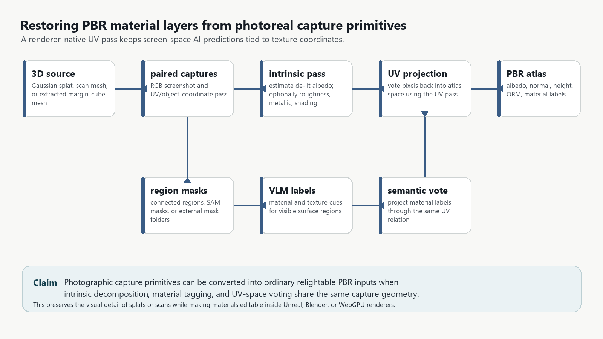
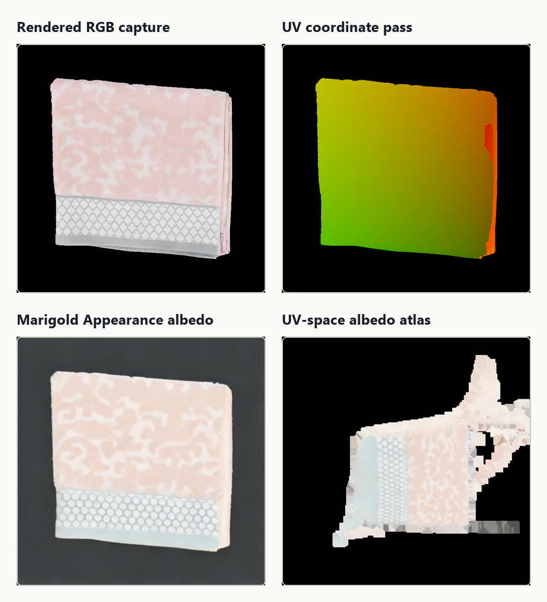
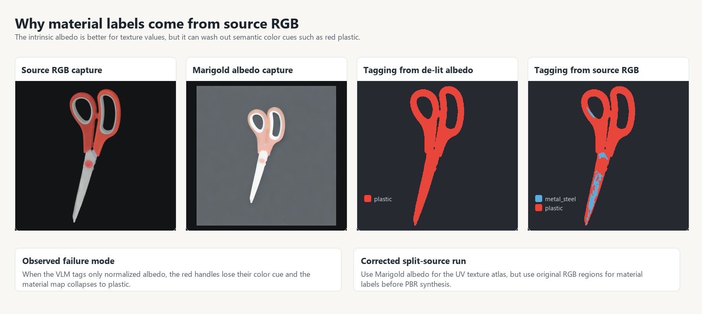
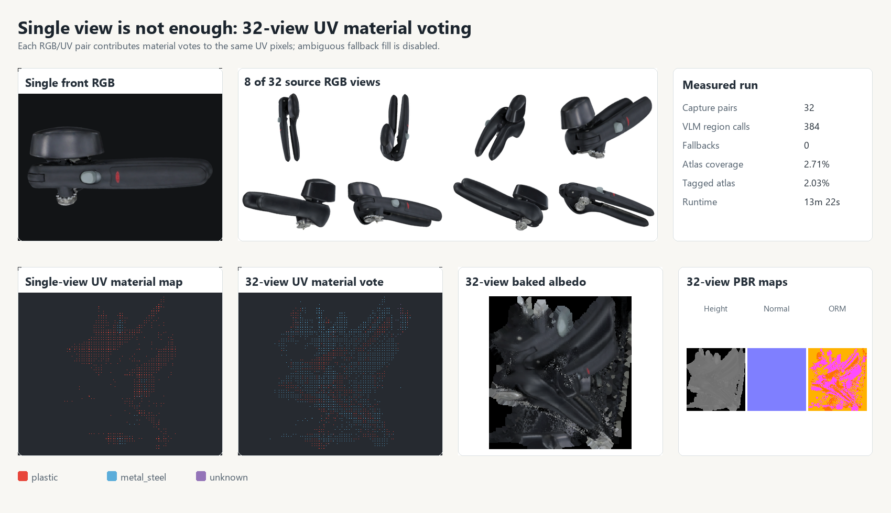
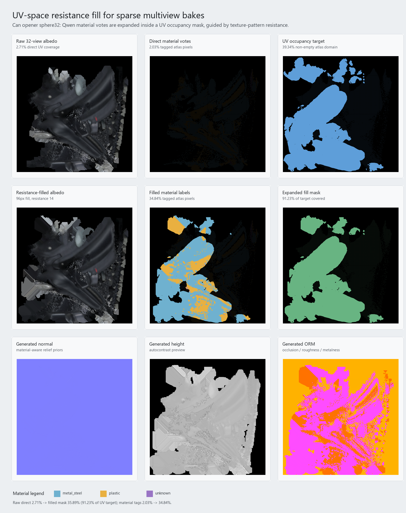
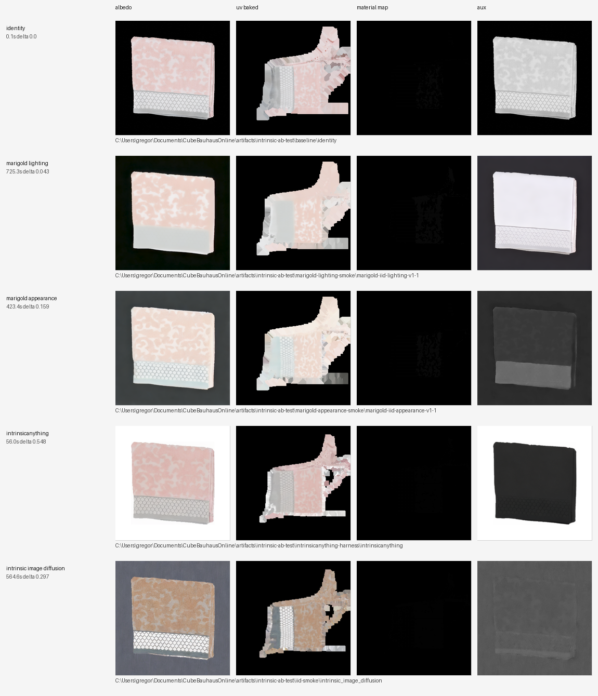
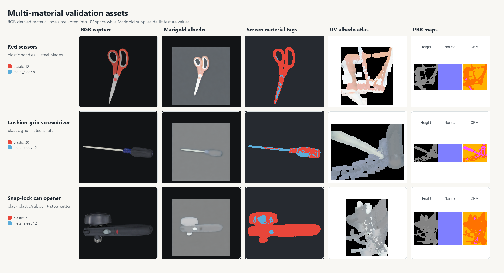

# UV-Guided Recovery of PBR Material Atlases from Photoreal Capture Primitives

**Gregor Hubert Max Koch**  
Independent Researcher  
2026-06-17

## Abstract

Photoreal capture methods such as 3D Gaussian splatting and photogrammetry can reproduce scenes with high visual fidelity, yet their appearance representation is usually not a renderer-native material model. Captured colors often mix base color, shadows, highlights, view-dependent response, and exposure. As a result, assets that look plausible under their original capture illumination can fail when relit in physically based renderers. This paper presents a prototype pipeline for converting paired RGB and UV-coordinate screen captures into physically based rendering (PBR) texture atlases. The method renders overlapping RGB/UV views, applies intrinsic-image decomposition to estimate de-lit appearance, segments and semantically tags material regions from the original RGB observations, votes those observations into UV texture space, and completes sparse atlas regions using a UV-occupancy-constrained resistance fill. A validation run on a multi-material scanned can opener shows that direct 32-view UV voting is more reliable than a single view but remains sparse: direct atlas coverage is 2.71%, with 2.03% tagged material coverage. Applying a 96-pixel resistance fill constrained by an inferred UV occupancy mask expands usable atlas coverage to 35.89% and tagged material coverage to 34.84%, while avoiding empty atlas padding. The result is not a calibrated inverse-rendering solution, but it demonstrates a practical bridge from capture-native appearance to conventional albedo, material-label, normal, height, and occlusion/roughness/metallicity (ORM) maps.

**Keywords:** Gaussian splatting, photogrammetry, physically based rendering, intrinsic images, UV atlas baking, material segmentation, neural rendering, texture synthesis

## 1. Introduction

Photoreal capture primitives are increasingly used as production assets. 3D Gaussian splatting provides real-time novel-view rendering quality from optimized anisotropic Gaussian primitives [1], and photogrammetry pipelines can produce textured meshes from dense image observations. These representations are highly effective when the objective is to reproduce the captured scene under the captured lighting. They are less effective when the asset must become a reusable object in a physically based renderer.

PBR workflows expect texture layers with distinct semantics: base color, normal, roughness, metallicity, ambient occlusion, height, and sometimes explicit material identifiers. A captured radiance texture does not provide those layers. It embeds illumination, shadows, specular response, camera exposure, and sometimes view-dependent effects. If such an asset is placed into a new scene with new lighting, the renderer has too little material information to respond plausibly.

This paper asks whether a renderer-facing material representation can be recovered from screen-space observations while preserving texture-space correspondence. The proposed answer is a UV-guided capture and baking pipeline. Every image-space operation is paired with an aligned UV-coordinate pass, so predictions produced in screen space can be written back into a conventional texture atlas.

The contribution is not a new foundation model. It is a practical integration pattern:

1. Render overlapping RGB and UV-coordinate captures from a mesh, scanned object, or splat-derived proxy.
2. Estimate de-lit albedo candidates using intrinsic-image methods.
3. Segment and tag material regions from original RGB views, preserving visual cues that de-lighting can suppress.
4. Vote albedo and material evidence into UV atlas space.
5. Complete sparse atlas samples with a resistance-weighted UV fill constrained by known UV occupancy.
6. Generate renderer-consumable PBR maps from the completed atlas.

## 2. Related Work

3D Gaussian Splatting represents scenes with optimized anisotropic 3D Gaussians and has become a strong real-time view-synthesis representation [1]. Its optimized appearance is not, by itself, a PBR material description. This creates a gap between capture-native radiance and renderer-native material layers.

Physically based shading workflows commonly use BRDF models and authored texture channels to control base color, normals, roughness, metallicity, and occlusion. The Disney principled shading model is a practical reference point for artist-facing PBR material parameters [2].

Intrinsic image decomposition attempts to separate material reflectance from illumination. Marigold adapts diffusion-based generative priors to image-analysis tasks and includes intrinsic-image decomposition checkpoints [3, 4]. IntrinsicAnything and Intrinsic Image Diffusion are related approaches for inverse rendering or single-view material estimation [5, 6]. These systems can produce useful albedo candidates, but their outputs must be grounded in texture space before they are useful as renderer assets.

Segmentation foundation models such as Segment Anything provide strong region proposals [7]. In this prototype, connected color-region segmentation is sufficient for controlled smoke tests, while SAM/SAM2-style masks remain an important path for harder objects with broad reflective or glossy areas.

The validation examples use Google Scanned Objects, a public collection of scanned household items [8]. The procedural PBR map generation baseline is adapted from the open `pbr-from-pixelart` project [9].

## 3. Method

The method treats UV correspondence as the central contract. Screen-space models are allowed to operate on ordinary images, but their predictions are only accepted if they can be projected through an aligned UV-coordinate pass.



**Figure 1.** Pipeline overview. RGB views provide visual evidence; UV-coordinate views preserve the mapping back into renderer-native texture space.

| Stage | Input | Output | Purpose |
|---|---|---|---|
| Paired capture | Mesh, scan, or splat-derived proxy | RGB image and UV-coordinate image | Preserve image-space appearance and texture-space address. |
| Intrinsic decomposition | RGB capture | De-lit albedo candidate | Reduce lighting contamination in base color. |
| Region segmentation | Original RGB capture | Material-relevant masks | Preserve semantic color and shape cues. |
| Material tagging | RGB region crops | Semantic material labels | Estimate material priors such as plastic or steel. |
| UV voting | Albedo, material labels, UV pass | Sparse UV albedo and material atlas | Write screen-space evidence into texture space. |
| UV resistance fill | Sparse atlas and UV occupancy mask | Completed atlas domain | Fill voids without crossing strong texture boundaries or empty padding. |
| PBR synthesis | Completed albedo and labels | Normal, height, ORM | Produce renderer-facing maps. |

### 3.1 Paired RGB and UV Capture

For each camera view, two aligned images are rendered: a conventional RGB image and a UV-coordinate image. The UV image encodes where each visible screen pixel lands in atlas space. This pass is the mechanism that turns image-space predictions into texture-space data.

The UV-coordinate image is not treated as an appearance image and is not semantically tagged by the material model. Segmentation and material classification operate on RGB or intrinsic/de-lit RGB observations. The resulting screen-space masks are then projected through the UV-coordinate image into atlas space. In other words, the UV page is the transfer function, not the material evidence.



**Figure 2.** A rendered RGB capture and an aligned UV pass. The UV pass allows image predictions to be projected into the atlas.

### 3.2 Split-Source Material Tagging

Intrinsic decomposition can improve albedo quality, but it can also remove visual cues needed for semantic material identification. In an early multi-material scissors test, tagging from de-lit albedo weakened the red-handle cue and collapsed parts of the map toward generic plastic. The corrected pipeline uses original RGB captures for segmentation and material tagging, while using intrinsic decomposition only for albedo values.



**Figure 3.** Split-source tagging. Material labels are inferred from original RGB regions; de-lit albedo is used for texture values.

### 3.3 Multiview Material Voting

A single view is not sufficient for material correctness. It is front-view biased, omits occluded materials, and produces sparse atlas coverage. The prototype therefore renders a generated `sphere32` capture set: 32 overlapping RGB/UV capture pairs distributed around the asset.

For every valid screen pixel, the UV pass identifies the atlas texel to update. Color samples accumulate into an averaged albedo atlas. Material labels accumulate into integer vote maps, one per material class. The final material map chooses the material with the strongest vote at each texel.



**Figure 4.** Single-view material labels are sparse and biased. The 32-view capture set contributes repeated observations to the same UV atlas.

### 3.4 UV-Space Resistance Fill

Even 32 overlapping views remain sparse because the screen-space raster samples only a small fraction of a high-resolution atlas. Naive dilation can fill holes, but it can also spread into empty atlas padding or cross material boundaries. The implemented completion step uses a UV-occupancy-constrained resistance fill.

Let `M` be a target UV occupancy mask and `G` a provisional guide image produced from the sparse albedo. A missing texel `p` inside `M` receives contributions from neighboring valid texels `q` with weight:

```text
w(p, q) = exp(-r * ||G(p) - G(q)||)
```

where `r` is a resistance parameter. This permits propagation through smooth texture neighborhoods while reducing propagation across strong color or material-edge changes. The same guide is used to expand integer material labels, so labels follow compatible texture neighborhoods instead of simple nearest-neighbor padding.

For scanned meshes, the UV occupancy mask can often be inferred from non-empty source texture pixels. For splat-derived meshes, it should be rasterized directly from extracted UV triangles.



**Figure 5.** UV-space resistance fill on the 32-view can-opener run. Sparse votes are expanded inside the inferred UV occupancy domain.

## 4. Experiments

The prototype was evaluated as an engineering smoke test rather than a benchmark. The goal was to test whether a complete RGB-to-UV-to-PBR path could be run end-to-end on assets with visibly divergent materials.

### 4.1 Intrinsic Backend Smoke Test

An initial towel scan was used to compare intrinsic/de-lighting backends. Marigold Appearance was selected as the practical default because it preserved texture structure while producing a useful de-lit albedo candidate.

| Backend | Produced channels | Runtime | Mean RGB delta | Observation |
|---|---:|---:|---:|---|
| Identity baseline | Albedo copy, grayscale shading | 0.1 s | 0.000 | Control with no de-lighting. |
| Marigold Lighting | Albedo, shading, residual | 725.3 s | 0.043 | Strong lighting separation, but suppressed woven detail. |
| Marigold Appearance | Albedo, roughness, metallicity | 423.4 s | 0.159 | Best default in this smoke test. |
| IntrinsicAnything | Albedo, specular | 56.0 s | 0.548 | Fast, but lifted background and compressed contrast. |
| Intrinsic Image Diffusion | Albedo, roughness, metal | 564.6 s | 0.297 | Successful, with gray/brown relighting bias. |



**Figure 6.** Intrinsic backend comparison and downstream atlas outputs.

### 4.2 Multi-Material Objects

The towel object was not a meaningful material-divergence test, so the pipeline was repeated on scanned household objects with visible combinations such as plastic and steel.



**Figure 7.** Multi-material validation examples. These runs revealed that single-view coverage and labeling are not sufficient.

| Asset | Expected material contrast | RGB-derived segment labels | Vision calls | Fallbacks | Direct atlas coverage |
|---|---|---|---:|---:|---:|
| Red scissors | Plastic handles, steel blades | `plastic` 12, `metal_steel` 8 | 21 | 0 | 0.83% |
| Cushion-grip screwdriver | Plastic grip, steel shaft | `plastic` 20, `metal_steel` 12 | 33 | 0 | 0.47% |
| Snap-lock can opener | Black plastic/rubber, steel cutter | `plastic` 7, `metal_steel` 12 | 20 | 0 | 0.91% |

### 4.3 Can-Opener Multiview Completion

The most complete run used a snap-lock can opener with black plastic/rubber and steel parts. A single front view produced a material map dominated by the visible handle. The `sphere32` pass shifted the vote toward the steel regions visible from other views, but direct UV coverage remained sparse.

| Capture protocol | Capture pairs | Region calls | Fallbacks | Direct atlas coverage | Tagged atlas coverage | Main issue |
|---|---:|---:|---:|---:|---:|---|
| Single front view | 1 | 20 | 0 | 0.91% | 0.91% | Front-view material bias. |
| `sphere32` multiview | 32 | 384 | 0 | 2.71% | 2.03% | Better vote, still sparse. |

The inferred UV occupancy target covered 39.34% of the atlas. A 96-pixel resistance fill covered 35.89% of the atlas, corresponding to 91.23% of that target, and expanded tagged material coverage to 34.84%.

| UV completion stage | Atlas coverage | Tagged atlas coverage | Notes |
|---|---:|---:|---|
| Direct `sphere32` samples | 2.71% | 2.03% | Trusted but too sparse for renderer export. |
| UV occupancy target | 39.34% | n/a | Estimated island domain from the scan texture. |
| 96px resistance fill | 35.89% | 34.84% | Covers 91.23% of target while avoiding empty atlas padding. |

The filled material map contained 266,033 `metal_steel`, 98,414 `plastic`, and 883 `unknown` pixels.

## 5. Discussion

The useful result is architectural: screen-space analysis can be inserted into a renderer pipeline if UV correspondence is captured alongside RGB appearance. This allows intrinsic predictions, segmentation masks, and material labels to become ordinary texture atlases rather than remaining image-space annotations.

The method also clarifies why a naive one-image approach is inadequate. Material labels require multiview evidence; de-lit albedo and material semantics should come from different sources; and UV completion must be constrained by the actual atlas domain. The resistance fill is not a substitute for ground-truth texture reconstruction, but it is a practical step between sparse trusted samples and usable renderer inputs.

The approach is relevant to Gaussian splat workflows because splats are compelling capture primitives but awkward as relightable asset primitives. If a splat can be rendered with a coordinate pass, converted to a proxy mesh, or sampled into a textured surface, the same UV-guided material recovery pattern can be applied.

## 6. Limitations

This prototype should not be interpreted as a physically calibrated inverse-rendering method. It has several limitations:

1. The validation set is small and should be expanded into a benchmark with ground-truth or human-reviewed material labels.
2. The generated roughness, metallicity, height, and normal maps are plausible renderer inputs, not measured physical properties.
3. The material tagger can fail on ambiguous regions, glossy surfaces, small parts, or mixed-material crops.
4. Intrinsic decomposition can remove material cues or preserve lighting artifacts depending on object and illumination.
5. The UV resistance fill depends on a good UV occupancy mask; splat-derived meshes need reliable UV triangle rasterization.
6. The current results test atlas generation, not final relighting quality under controlled lights.
7. The validated run used connected color-region segmentation plus VLM tagging. Diffusion/SAM-style masking is supported as a direction for harder scenes, but it was not the measured configuration reported here.

## 7. Conclusion

This paper presents a practical prototype for recovering renderer-native PBR material atlases from photoreal capture primitives. The central engineering move is simple: capture UV correspondence alongside RGB appearance, then project image-space analysis back into texture space. With overlapping RGB/UV captures, intrinsic de-lighting, split-source material tagging, multiview UV voting, and UV-occupancy-constrained resistance fill, a capture-native representation can be converted into conventional albedo, material-label, normal, height, and ORM maps.

The next step is controlled relighting evaluation on real Gaussian-splat scenes and splat-derived meshes, with UV occupancy rasterized from extracted geometry rather than inferred from existing scan textures.

## Data and Code Availability

The implementation, paper figures, and a derived can-opener validation example are available at:

<https://github.com/cronos3k/gaussian-splat-pbr-materials>

The code is released under the GNU Affero General Public License v3.0 or later.

## Suggested Citation

Koch, Gregor Hubert Max. (2026). *UV-Guided Recovery of PBR Material Atlases from Photoreal Capture Primitives*. Preprint.

## References

1. Kerbl, B., Kopanas, G., Leimkuehler, T., and Drettakis, G. **3D Gaussian Splatting for Real-Time Radiance Field Rendering.** ACM Transactions on Graphics, 2023. <https://arxiv.org/abs/2308.04079>
2. Burley, B. **Physically-Based Shading at Disney.** SIGGRAPH Course Notes, 2012. <https://disneyanimation.com/publications/physically-based-shading-at-disney/>
3. Ke, B., et al. **Marigold: Affordable Adaptation of Diffusion-Based Image Generators for Image Analysis.** <https://github.com/prs-eth/marigold>
4. **Marigold IID Appearance v1-1 Model Card.** Hugging Face. <https://huggingface.co/prs-eth/marigold-iid-appearance-v1-1>
5. ZJU3DV. **IntrinsicAnything: Learning Diffusion Priors for Inverse Rendering Under Unknown Illumination.** <https://github.com/zju3dv/IntrinsicAnything>
6. Kocsis, P., Sitzmann, V., and Niessner, M. **Intrinsic Image Diffusion for Indoor Single-view Material Estimation.** CVPR 2024. <https://arxiv.org/abs/2312.12274>
7. Kirillov, A., et al. **Segment Anything.** ICCV 2023. <https://arxiv.org/abs/2304.02643>
8. Downs, L., et al. **Google Scanned Objects: A High-Quality Dataset of 3D Scanned Household Items.** ICRA 2022. <https://arxiv.org/abs/2204.11918>
9. Koch, Gregor Hubert Max. **Gaussian Splat PBR Materials.** <https://github.com/cronos3k/gaussian-splat-pbr-materials>
